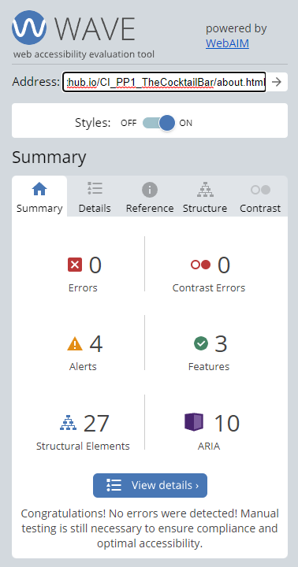
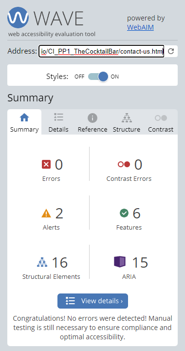
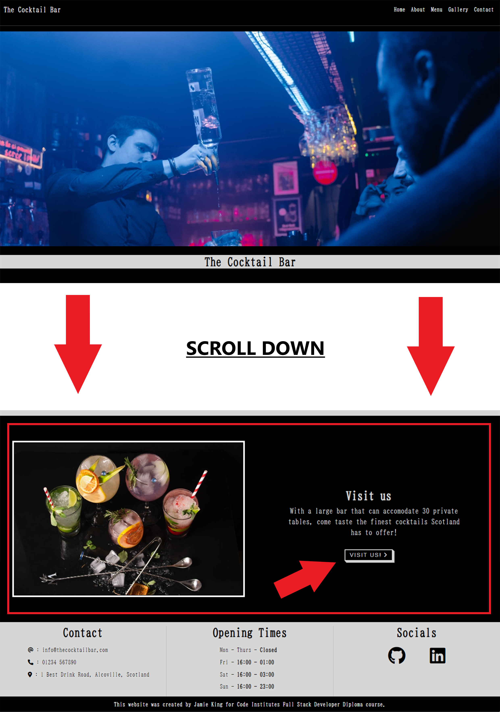
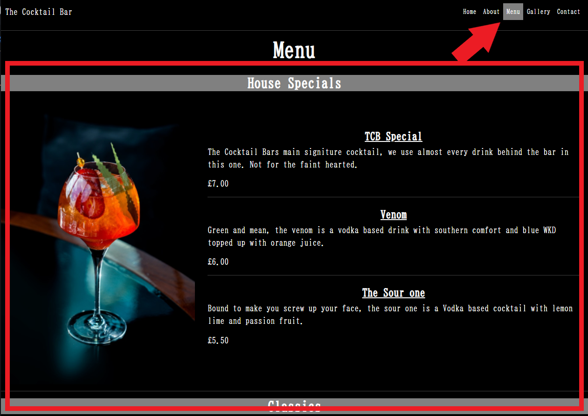
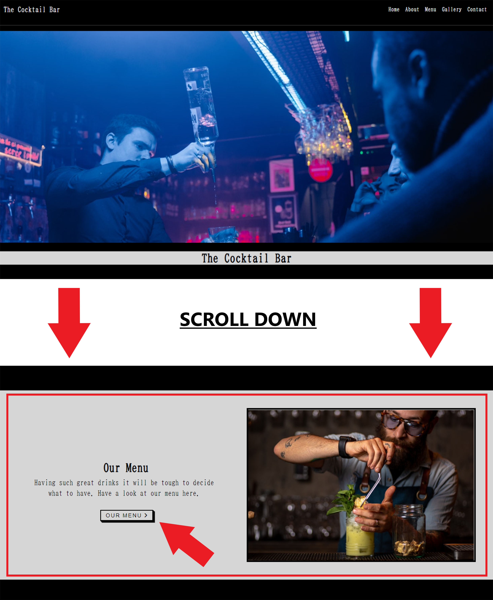

# The Cocktail Bar
Developer: Jamie King

[The Cocktail Bar](https://jkingportfolio.github.io/CI_PP1_TheCocktailBar/index.html) website has been developed to provide potential and returning customers information regarding the menu, news, where to find us and the opportunity to book a table at The Cocktail Bar. The bar itself is fictional.

## Table of Contents

1. [Project Goals](#project-goals)
    1. [User Goals](#user-goals)
        1. [First time users](#first-time-users)
        2. [Returning users](returning-users)
    2. [Site Owner Goals](#site-owner-goals)
2. [User Experience](#user-experience)
    1. [Target Audience](#tager-audience)
    2. [User Requirements / Expectations](#user-requirements-expectations)
    3. [User Stories](#user-stories)
3. [Design](#design)
    1. [Design Choices](#design-choices)
    2. [Colour](#colours)
    3. [Fonts](#fonts)
    4. [Structure](#structure)
    5. [Wireframes](#wireframes)
4. [Technologies Used](#technologies)
    1. [Languages](#languages)
    2. [Frameworks and Tools](#frameworks-tools)
5. [Features](#features)
6. [Testing](#testing)
    1. [HTML Valiadation](#html-validation)
    2. [CSS Validation](#css-validation)
    3. [Accessibility](#accessibility)
    4. [Performance](#performance)
    5. [Device Testing](#device-testing)
    6. [Browser Compatibility](#browser-compatibility)
    7. [Testing User Stories](#testing-user-stories)
7. [Bugs](#bugs)
8. [Deployment](#deployment)
9. [Credits](#credits)
10. [Acknowledgements](#acknowledgements)

## Project Goals

### User Goals

- #### First time users
    - A first time user would want to easily understand the main purpose of the site.
    - A first time user would want to easily navigate the website to explore the content.
    - A first time user would want to find the websites socials to be able to further connect and legitimise how well known and trusted they are.
- #### Returning users
    - A returning user would want to be able to visit the news section to quickly be informed of any news whether it be on new drinks or announcements such as new events.
    - A returning user would like to use the contact form in order to book another table at the bar
    - A returning user would like to contact the site creator which can be done by using the easily found socials links on the footer of each page

### Site Owner Goals

- Bring awareness to a broader audience of the existance of The Cocktail Bar thus increasing customer foot fall
- Provide a way for new and existing customers to engage with the buisness
- Provide a clear and hassle free method for customers to book a table via booking form.

## User Experience

### Target Audience

- People looking to have a casual drink
- People looking to find a venue for an event such a birthday
- People looking for a venue to relax with friends

### User requirements and expectations

- Find information easy and quick
- Navigate the pages easily
- Links and website functions to act as expected
- An easy way to book a table at the bar
- Simple "too the point" content that which a user can quickly digest

### User stories

#### First time user

1. As a first time user i would want to gain insight as to what type of establishment the bar is
2. As a first time user i would want to know more about the bar	
3. As a first time user i would want to know where the bar is located
4. As a first time user i would want to know the opening hours of the bar
5. As a first time user i would want to know the drinks available and their prices

#### Returning user

6. As a returning user i would want to know of recent news related to the bar
7. As a returning user i would want to see the menu
8. As a returning user i would want to find the phone number to book a table via telephone
9. As a returning use i would want to see the opening times
10. As a returning user i would want to book a table via an online booking system
11. As a returning user i would want to find the owners social media accounts

#### Site owner

12. As a site owner i would like to introduce the bar to potential clients
13. As the site owner i would want to be able to take bookings via an online form booking system
14. As the site owner i would want to have the ability to let its customers be aware of recent news such a Cocktail tasting events, changes to opening hours and additions to the menu
15. As a site owner i would like users to be able to easily navigate the site, creating a nice user experience
16. As a site owner i would like the user to intially be presented with a striking image to generate excitement about the site and the bar itself
17. As a site owner i would not want the user to have to result in using the browser back button to navigate back to the site if a 404 error occurs

## Design

### Design Choices

The website was designed with a simple monochrome theme in mind. This represents the simplicity of the website and the black and white transparency of the buisness to its customers.

### Colour

The colour palette for the website is made up of 4 main colours and an addition one for the owners signiture

- #000000 (Black)
- #FFFFFF (White)
- #808080 (Dark Gray)
- #D6D6D6 (Light Gray)
- #DFC373 (Matte Gold)

All colours contrast was tested using [EightShapes contrast grid](http://eightshapes.com/)

Colour Contrast Results

### Fonts

There were 3 fonts used in this project, they are stated below:
- BIZ UDmincho with a backup of serif is the main font used throughout the website
- open sans with a backup of serif was used for the button styles
- Reenie Beanie with a back up of cursive was used for the owners signiture, this is the only place this font is used

### Structure

The websites structure was carefully constructed with making it recognizable, user friendly and simple kept in mind. On arrival to the website the user will be presented with a hero image and a navigation bar which is uniform across all pages. The website is made of five individual pages:

- A homepage, with links to the key sections of the site
- An about page, which describes a brief history of the buisness, has customer reviews and as news section
- A menu page, which lists all drinks available
- A gallery page, which consists of a showcase of images
- A contact page, which consists of a booking form, map and where to find us area.

### Wireframes

Balsamiq was used in the intial design stage to layout sketches of each page and its design intent

Index

About

Menu

Gallery

Contact

404 page

## Technologies

### Coding Languages
- HTML
- CSS

### Frameworks and tools
- Balsamiq
- Git
- Github
- Gitpod
- Bootstrap v5.0
- Google Fonts
- Google Chrome Dev Tools
- Font Awesome
- Microsoft Paint

## Features

In its entirety the website consists of five main pages, one 404 error page and 16 features, two of which have a mobile version and tablet / desktop version. 

### Existing features

#### Nav Bar 

The navigation bar is featured on all five main pages and the error 404 page and includes 5 clickable links:

- Home
- About
- Menu
- Gallery
- Contact

- It is fully resposive due to using the Bootstrap v5.0.2 nav bar which then produces a toggler menu for smaller screens. 
- The navigation bar is located at the top of every page in the same location and allows users to navigate seamlessly through the site.
- A hover effect on the text of the navigation bar text allows the user to understand that it is a clickable link. Upon clicking the link the user will be taken to the desired page

##### Desktop 

##### Mobile

#### Hero Image

When visiting the website and initially being directed to the home page the user is greeted by the hero image on both desktop and mobile.

- The hero image sets the scene of the site indicating that the website is for a cocktail bar
- The hero image also has a "zoom" effect to give the user a feeling of immersion into the website. 

#### Index page sections

The home page includes 3 sub sections in which each will lead the user to the area they wish to visit in a quick manner.

- Whats new
    - Includes an image, a text explanation and a button which will link directly to the news section on the about page. This was done by using an id link

- Covered in user stories: 6

- Our Menu
    - Includes an image, a text explanation and a button which will link directly to the menu page.

- Covered in user stories: 7

- Visit us
    - Includes an image, a text explanation and a button which will link directly to the menu page.

- Covered in user stories: 3

#### Our Story

- The our story section gives a brief history of the bar 
- At the bottom of the story is a signiture in gold to give the user a feeling of prestige in regards to the owner.

- Covered in user stories: 2 & 12

#### YouTube video

There is an embedded video which is used to bring more life to the page

- Covered in user stories: 1

#### Customer reviews

There is a customer review section.

- This provides feedback for not only potential customers but also the bar itself to further improve
- By having customers faces here shows that the bar has real clients

- Covered in user stories: 2

#### News

The news section is made up of 6 blocks

- Each block communicates one of several updates to the user
- Each block has a hover over effect

- Covered in user stories: 6 & 14

#### Menu

The menu section is split into 3 categories and provides the user with the following:

- The name of the cocktail
- The price of the cocktail
- The use of a sticky header allows the user to know what category the current cocktails are even when scrolling down the page until the point in which the next category is reached.

- Covered in user stories: 5 & 7

#### Gallery

The Gallery page is a page that consists of a collection of images from the bar to give users a sense of what to expect

- Covered in user stories: 1

#### Contact Form

The contact form provides a way for the user to book a table at the bar by providing the following details

- Name
- Email
- Phone number 
- Date and time
- A text area for additional comments or questions

- Covered in user stories: 10 & 13

#### Google Map

 An embedded google map is used to allow to use the find directions to the bar. (Please note due to this bar being fictional the location of the Bar has been generalised to be that of Aberdeen, Scotland)

 - Covered in user stories: 3

#### Where to find us

- The where to find us feature condenses all information needed to get in contact with the bar or locate it. 
- For the mobile version this section is not displayed, this decision was made due to the fact it would mean it would sit directly above the footer contact which would perhaps look odd to the user.

- Covered in user stories: 3 & 8

#### Footer

- The footer is featured on all five main pages and the error 404 page and includes 3 sections:

    - Contact
    - Opening Times
    - Socials

- There are three clickable links
    - The email address in the contact section will open an email mailbox of the user in order for them to easily email the bar with any questions they may have
    - The GitHub icon which links to my own personal GitHub page for future showcasing of my projects
    - The linkedin icon which links to my own personal Linkedin page for networking with fellow coders or potential future employers

- Covered in user stories: 3, 4, 8, 9 & 11

- Desktop

- Mobile

#### 404 error page

- The 404 error page features is used when a user tries to navigate to a page that does not exist. This page will allow users to navigate back to the home page via the return home button or by clicking on any of the nav bar links creating a good user experience that does not require the use of the browser back button.

### Future implementations

In the future as my skills grow i would like to implement the following features:

- A downloadable PDF version of the menu
- Create a functioning newletter
- Add a back up arrow button to the footer to provide the user with a quick and easy way to navigate back to the top of the page

## Testing

### HTML Validation
[W3C Markup Validation](https://validator.w3.org/) was used to validate the HTML code of The Cocktail Bar website. All pages passed and produced no errors.

Index

About

Menu

Gallery

Contact

404 page

### CSS Validation

[W3C Jigsaw CSS validation](https://jigsaw.w3.org/css-validator/) was used to validate the CSS used in the website. The file passed and produced no errors if testing my own CSS however it did produced some warnings which are related to bootstrap 5.0.2

CSS styles

Bootstrap warnings

### Accessibility

[The WAVE WebAIM](https://wave.webaim.org/) tool for evaluating accessibility of a webpage was used to verify that all pages of the site met the needs for users with disabilities.

Index

About

Menu

Gallery

Contact

404 page

- Icons from Font Awesome are used in the site. As they are for decorative purposes only, Font Awesome already populates the code to be copied with an aria-hidden="true" attribute to accomodate accessibility.

### Performance

[Chrome dev tools lighthouse](https://developers.google.com/web/tools/lighthouse) was used to test all pages for performance, accessibility, best practices and SEO

Index

About

Menu

Gallery

Contact

404 page

### Device Testing

The website was tested on the following devices:
- Xiaomi Redmi note 10 pro
- Windows 10 PC with a 24" MSI Curved gaming monitor

In addition to testing on physical devices, the site was also tested using Google Chrome Developer Tools pre defined devices and also the responsive mode in which i would slowly increase the width of the screen to ensure resposiveness worked across all display sizes.

### Browser Compatibility

The website was tested on the following web browsers:
- Google Chrome Version 101.0.4951.67
- DuckDuckGo

### Testing User Stories

#### First time users

1. As a first time user i would want to gain insight as to what type of establishment the bar is

| Feature       | Action        | Expected Result  | Actual Result |
| ------------- | ------------- | -------------    | ------------- |
| Gallery  | Using the Nav Bar navigate to the Gallery page  | Gallery page opens and displays all images     | Works as intended  |
| Video  | Navigate to the About page, scroll down to video  | Video is displayed on page ready to play, this will not autoplay     | Works as intended  |

Screenshots

2. As a first time user i would want to know more about the bar	

| Feature       | Action        | Expected Result  | Actual Result |
| ------------- | ------------- | -------------    | ------------- |
| Our Story  | Navigate to the About page, Our story is located at the top of the page  | To be presented with information about the bar    | Works as intended  |
| Customer reviews | Navigate to the About page, scroll down to customer views section  | To be presented with customer reviews of the bar     | Works as intended  |

Screenshots

3. As a first time user i would want to know where the bar is located

| Feature       | Action        | Expected Result  | Actual Result |
| ------------- | ------------- | -------------    | ------------- |
|Visit us  | On Home page scroll down to Visit us section and click on the Visit us button  | To be taken to the contact page to see the map and address of the bar     | Works as intended  |
| Map  | Navigate to the Contact page  | To be presented with a map of the bar location    | Works as intended  |
| Footer - contact section  | Scroll down to the footer section on any page   | To be provided with bar location details     | Works as intended  |
| Where to find us  | Navigate to the Contact page to view the where to find us section on the right hand side  | To be provided with bar location details     | Works as intended when on desktop, this will not work on mobile as it is a feature that is not display on displays smaller than 768px |

Screenshots

4. As a first time user i would want to know the opening hours of the bar

| Feature       | Action        | Expected Result  | Actual Result |
| ------------- | ------------- | -------------    | ------------- |
| Footer - Opening times section  | Scroll down to the footer section on any page  | To be provided with opening times     | Works as intended  |

Screenshots

5. As a first time user i would want to know the drinks available and their prices

| Feature       | Action        | Expected Result  | Actual Result |
| ------------- | ------------- | -------------    | ------------- |
| Menu  | Navigate to the Menu page  | To arrive at the menu page and be presented with information on drink types and prices     | Works as intended  |

Screenshots

#### Returning users

6. As a returning user i would want to know of recent news related to the bar

| Feature       | Action        | Expected Result  | Actual Result |
| ------------- | ------------- | -------------    | ------------- |
| Whats new  | On the home page scroll down to the whats new section and click on the whats new button  | To be taken to the News section on the About page     | Works as intended  |
| News  | Navigate to the About page, scroll down to the news section  | To view the news section at the bottom of the page     | works as intended  |

Screenshots

7. As a returning user i would want to see the menu

| Feature       | Action        | Expected Result  | Actual Result |
| ------------- | ------------- | -------------    | ------------- |
| Our Menu  | On the home page scroll down to the Our menu section  | To arrive at the menu page and be presented with information on drink types and prices      | Works as intended  |
| Menu  | Navigate to the Menu page  | To arrive at the menu page and be presented with information on drink types and prices     | Works as intended  |

Screenshots

8. As a returning user i would want to find the phone number to book a table via telephone

| Feature       | Action        | Expected Result  | Actual Result |
| ------------- | ------------- | -------------    | ------------- |
| Footer - Contact section  | Scroll down to the footer section on any page  | To be presented with the phone number for the bar     | Works as intedned  |
| Where to find us  | Navigate to the Contact page to view the where to find us section on the right hand side  | To be presented with the phone number for the bar     | Works as intended  |

Screenshots

9. As a returning use i would want to see the opening times

| Feature       | Action        | Expected Result  | Actual Result |
| ------------- | ------------- | -------------    | ------------- |
| Footer - Opening times section  | Scroll down to the footer section on any page  | To be presented with the opening times for the bar     | Works as intended  |
| Where to find us  | Navigate to the Contact page to view the where to find us section on the right hand side  | To be presented with the opening time for the bar     | Works as intended  |

Screenshots

10. As a returning user i would want to book a table via an online booking system

| Feature       | Action        | Expected Result  | Actual Result |
| ------------- | ------------- | -------------    | ------------- |
| Contact form  | Navigate to the contact page and fill in the fields and click submit  | For the codeinstitute form dump page to display with all information that was entered     | Works as intended  |

Screenshots

11. As a returning user i would want to find the owners social media accounts

| Feature       | Action        | Expected Result  | Actual Result |
| ------------- | ------------- | -------------    | ------------- |
| Footer - Socials section  | Scroll down to the footer section on any page  | To be provided with the icons for the relevant social channels which open in a new window upon clicking     | Works as intended  |

Screenshots

#### Site owner

12. As a site owner i would like to introduce the bar to potential clients

| Feature       | Action        | Expected Result  | Actual Result |
| ------------- | ------------- | -------------    | ------------- |
| Our story  | Navigate to the About page, Our story is located at the top of the page  | To be presented with information and background of the bar     | Works as intended  |

Screenshots

13. As the site owner i would want to be able to take bookings via an online form booking system

| Feature       | Action        | Expected Result  | Actual Result |
| ------------- | ------------- | -------------    | ------------- |
| Contact form  | Navigate to the contact page and fill in the fields and click submit  | For the codeinstitute form dump page to display with all information that was entered     | Works as intended  |

Screenshots

14. As the site owner i would want to have the ability to let its customers be aware of recent news such a Cocktail tasting events, changes to opening hours and additions to the menu

| Feature       | Action        | Expected Result  | Actual Result |
| ------------- | ------------- | -------------    | ------------- |
| News  | Navigate to the About page, scroll down to the news section  | To be presented with various updates and news related to the bar     | Works as intended  |

Screenshots

## Bugs

During the project i encountered a number of bugs some of which were solved some of which were not as stated below:

| Bug           | Fix           |
| ------------- | ------------- |
| On smaller page lengths the footer would sit high and be very long  | Adding a div called error-container which states the min-height: calc(100vh-270px); where 270 is the height of the footer ensured the main div was big enough that the footer error would not occur |
| I wanted to provide a link from the new drink on the news blocks to the menu however the sticky header would obstruct the drink name when directed to the menu | Currently i could not think of a fix for this so i decided to not proceed with this feature to ensure there is a fully functioning website at the expense of one extra feature  
|  On the contact section of the footer from 768px to 830px width the email text sits below the at sign icon |  The only fix i could think of for this was to reduce the font size however that would either involve having one piece of text smaller than the rest of the site which would not be go UI and the other option was to reduce the font size on all text which i didnt think looked good so it was kept as is for that small distance of pixel width

## Deployment

### Github Pages

This project was deployed to GitHub pages in the projects early stages to allow continual resposive testing. This was acheived via the following steps:

1. Navigate to www.github.com and log in.
2. Once logged in navigate to the projects [GitHub Repository](https://github.com/jkingportfolio/CI_PP1_TheCocktailBar)
3. Click on the settings button at the top right corner of the repository.
4. Select Pages from the left hand side menu.
5. For the source, select Branch:Master and click save.
6. The webpage will refresh automatically displaying a message at the top of the ribbon stating "Your site is publish at https://jkingportfolio.github.io/CI_PP1_TheCocktailBar/
7. The site is now live online and can be viewed by anyone.

### Forking the GitHub Repository

We can make a copy of the original repository on our GitHub account to view or make changes too without affecting the original repository, this is known as forking. Forking in GitHub can be done via the following steps:

1. Navigate to www.github.com and log in.
2. Once logged in navigate to the desired [GitHub Repository](https://github.com/jkingportfolio/CI_PP1_TheCocktailBar) that you would like to fork.
3. At the top right corner of the page click on the fork icon.
4. There should now be a copy of your original repository in your Github account.

Please note if you are not a member of an organisation on GitHub then you will not be able to fork your own repository.

### Clone a GitHub Repository

You can make a local clone of a repository via the following steps: 

1. Navigate to www.github.com and log in.
2. Once logged in navigate to the desired [GitHub Repository](https://github.com/jkingportfolio/CI_PP1_TheCocktailBar) that you would like to clone.
3. Locate the code button at the top, above the repository file structure.
4. Select the prefered clone method from HTTPS. SSH or GitHub CLI then click the copy button to copy the URL to your clipboard.
5. Open Git Bash
6. Update the current working direction to the location in which you would like the clone directory to be created.
7. Type `git clone` and paste the previously copied URL at Step 4.
8. `$ clone https://github.com/jkingportfolio/CI_PP1_TheCocktailBar`
9. Now press enter and the local clone will be created at the desired local location

## Credits

### Images

- [bartender](assets/images/bartender.jpg): Osvaldo Romito (https://pexels.com/@18393328/)
- [cocktail-drink-selection](assets/images/cocktail-drink-selection.jpgg): Aram (https://pexels.com/@aram-3853019/)
- [customer-1](assets/images/customer-1.jpg): Jc Laurio (https://pexels.com/@juanlaurio/)
- [customer-2](assets/images/customer-2.jpg): cottonbro (https://pexels.com/@cottonbro)
- [customer-3](assets/images/customer-3.jpg): cottonbro (https://pexels.com/@cottonbro)
- [gallery-1](assets/images/gallery-1.jpg): mentatdgt (https://pexels.com/mentatdgt-330508/)
- [gallery-2](assets/images/gallery-2.jpg): Axel Breuer (https://pexels.com/@axelbreuer/)
- [gallery-3](assets/images/gallery-3.jpg): Clam Lo (https://pexels.com/@clam-lo-1782448/)
- [gallery-4](assets/images/gallery-4.jpg): Christian Fridell (https://pexels.com/@fridell/)
- [gallery-5](assets/images/gallery-5.jpg): Helena Lopes (vpexels.com/@wildlittlethingsphoto/)
- [hero-image-medium](assets/images/hero-image-medium.jpg): MART PRODUCTION (https://pexels.com/@mart-production)
- [hero-image-small](assets/images/hero-image-small.jpg): MART PRODUCTION (https://pexels.com/@mart-production)
- [lounge-with-drinks](assets/images/lounge-with-drinks.jpeg): Rachel Claire (https://pexels.com/@rachel-claire/)
- [menu-image-1](assets/images/menu-image-1.jpg): Anna Tis (https://pexels.com/@anna-tis-2762697/)
- [menu-image-2](assets/images/menu-image-2.jpg): Anna Tis (https://pexels.com/@anna-tis-2762697/)
- [menu-image-3](assets/images/menu-image-3.jpg): Ruslan Khmelevsky (https://pexels.com/@ruslanua/)

### Video

- The embedded video used on the index page was taken from [Patrón Tequila Youtube Channel](https://www.youtube.com/c/patrontequila). Make Any Cocktail Simply Perfect | Patrón Tequila

### Code

 Code from external sources were used in this project, they are credited below:
- HTML code for the collapsable Nav Bar was taken from a [YouTube tutorial](https://www.youtube.com/watch?v=akXfF066MY0) by [A Designer Who Codes](https://www.youtube.com/channel/UCD00Is447lWaY04_gNTOaVA) and [Bootstrap v5.0.2 documentation](https://getbootstrap.com/docs/5.0/components/navbar/). External JavaScript file was also imported as per the [Bootstrap get started](https://getbootstrap.com/docs/5.2/getting-started/introduction/) page to allow use of the Bootstrap Tool kit. 
- Guidance on how to create a favicon was taken from [W3Schools](https://www.w3schools.com/html/html_favicon.asp)
- Code to embed a video from YouTube was taken from [tipswithpunch](https://www.youtube.com/watch?v=9YffrCViTVk) YouTube Channel
- Markdown cheat sheet used to help format my READme file by [adam-p](https://github.com/adam-p/markdown-here/wiki/Markdown-Cheatsheet)
- Button style code used for all buttons bar the submit button on the contact page was taken from [cssscan.com](https://getcssscan.com/css-buttons-examples).

### Literature

The use of reference books were used throughout the creation of this project and are credited below:

- The use of "CSS Pocket Reference" written by Eric A. Meyer, Published by O'Reilly
- The use "HTML5 Pocket Reference" written by Jennifer Niederst Robbins, Published by O'Reilly

### Misc

The source of where i learned how to produce a GitHub fork and clone was from the following pages of the GitHub Documentation. Although i did not use a fork or clone in this project it is something i hope to implement to future projects now i have the knowledge to do so.

- https://docs.github.com/en/get-started/quickstart/fork-a-repo
- https://docs.github.com/en/repositories/creating-and-managing-repositories/cloning-a-repository

## Acknowledgements

I would like to also thank the following:
- My wife and family for their support and feedback whilst doing this project
- My fellow Code Institute students whom i have bounced ideas and problems back and forth with via Slack