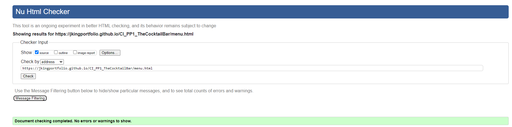

# The Cocktail Bar
(Developer: Jamie King)

[The Cocktail Bar](https://jkingportfolio.github.io/CI_PP1_TheCocktailBar/index.html) website has been developed to provide potential and returning customers information regarding the menu, news, where to find us and the opportunity to book a table at The Cocktail Bar. The bar itself is fictional.

## Table of Contents

1. [Project Goals](#project-goals)
    1. [User Goals](#user-goals)
        1. [First time users](#first-time-users)
        2. [Returning users](returning-users)
    2. [Site Owner Goals](#site-owner-goals)
2. [User Experience](#user-experience)
    1. [Target Audience](#tager-audience)
    2. [User Requirements / Expectations](#user-requirements-expectations)
    3. [User Stories](#user-stories)
3. [Design](#design)
    1. [Design Choices](#design-choices)
    2. [Colour](#colours)
    3. [Fonts](#fonts)
    4. [Structure](#structure)
    5. [Wireframes](#wireframes)
4. [Technologies Used](#technologies)
    1. [Languages](#languages)
    2. [Frameworks and Tools](#frameworks-tools)
5. [Features](#features)
6. [Testing](#testing)
    1. [HTML Valiadation](#html-validation)
    2. [CSS Validation](#css-validation)
    3. [Accessibility](#accessibility)
    4. [Performance](#performance)
    5. [Device Testing](#device-testing)
    6. [Browser Compatibility](#browser-compatibility)
    7. [Testing User Stories](#testing-user-stories)
7. [Bugs](#bugs)
8. [Deployment](#deployment)
9. [Credits](#credits)
10. [Acknowledgements](#acknowledgements)

## Project Goals

### User Goals

- #### First time users
    - A first time user would want to easily understand the main purpose of the site.
    - A first time user would want to easily navigate the website to explore the content.
    - A first time user would want to find the websites socials to be able to further connect and legitimise how well known and trusted they are.
- #### Returning users
    - A returning user would want to be able to visit the news section to quickly be informed of any news whether it be on new drinks or announcements such as new events.
    - A returning user would like to use the contact form in order to book another table at the bar
    - A returning user would like to contact the site creator which can be done by using the easily found socials links on the footer of each page

### Site Owner Goals

- Bring awareness to a broader audience of the existance of The Cocktail Bar thus increasing customer foot fall
- Provide a way for new and existing customers to engage with the buisness
- Provide a clear and hassle free method for customers to book a table via booking form.

## User Experience

### Target Audience

- People looking to have a casual drink
- People looking to find a venue for an event such a birthday
- People looking for a venue to relax with friends

### User requirements and expectations

- Find information easy and quick
- Navigate the pages easily
- Links and website functions to act as expected
- An easy way to book a table at the bar
- Simple "too the point" content in which a user can quickly digest

### User stories

#### First time user

#### Returning user

#### Site owner

## Design

### Design Choices

The website was designed with a simple monochromatic theme in mind. This represents the simplicity of the website and the black and white transparency of the buisness to its customers.

### Colour

The colour palette for the website is made up of 4 main colours and an addition one for the owners signiture

- #000000 (Black)
- #FFFFFF (White)
- #808080 (Dark Gray)
- #D6D6D6 (Light Gray)
- #DFC373 (Matte Gold)

All colours contrast was tested using [EightShapes contrast grid](http://eightshapes.com/)

Colour Contrast Results

### Fonts

There were 3 fonts used in this project, they are stated below:
- BIZ UDmincho with a backup of serif is the main font used throughout the website
- open sans with a backup of serif was used for the button styles
- Reenie Beanie with a back up of cursive was used for the owners signiture, this is the only place this font is used

### Structure

The websites structure was carefully constructed with making it recognizable, user friendly and simple kept in mind. On arrival to the website the user will be presented with a hero image and a navigation bar which is uniform across all pages. The website is made of five individual pages:

- A homepage, with links to the key sections of the site
- An about page, which describes a brief history of the buisness, has customer reviews and as news section
- A menu page, which lists all drinks available
- A gallery page, which consists of a showcase of images
- A contact page, which consists of a booking form, map and where to find us area.

### Wireframes

Balsamiq was used in the intial design stage to layout sketches of each page and its design intent

Index

About

Menu

Gallery

Contact

404 page

## Technologies

### Coding Languages
- HTML
- CSS

### Frameworks and tools
- Balsamiq
- Git
- Github
- Gitpod
- Bootstrap v5.0
- Google Fonts
- Google Chrome Dev Tools
- Font Awesome
- Microsoft Paint

## Features

### Current features

### Future implementations

### Youtube video

## Testing

### HTML Validation
[W3C Markup Validation](https://validator.w3.org/) was used to validate the HTML code of The Cocktail Bar website. All pages passed and produced no errors.

Index

About

Menu

Gallery

Contact

404 page

### CSS Validation

[W3C Jigsaw CSS validation](https://jigsaw.w3.org/css-validator/) was used to validate the CSS used in the website. The file passed and produced no errors if testing my own CSS however it did produced some warnings which are related to bootstrap 5.0.2

CSS styles

Bootstrap warnings

### Accessibility

[The WAVE WebAIM](https://wave.webaim.org/) tool for evaluating accessibility of a webpage was used to verify that all pages of the site met the needs for users with disabilities.

Index

About

Menu

Gallery

Contact

404 page

- Icons from Font Awesome are used in the site. As they are for decorative purposes only, Font Awesome already populates the code to be copied with an aria-hidden="true" attribute to accomodate accessibility.

### Performance

[Chrome dev tools lighthouse](https://developers.google.com/web/tools/lighthouse) was used to test all pages for performance, accessibility, best practices and SEO

Index

About

Menu

Gallery

Contact

404 page

### Device Testing

### Browser Compatibility

### Testing User Stories

## Bugs

### Sub sections

## Deployment

### Github Pages

This project was deployed to GitHub pages in the projects early stages to allow continual resposive testing. This was acheived via the following steps:

1. Navigate to www.github.com and log in.
2. Once logged in navigate to the [GitHub Repository](https://github.com/jkingportfolio/CI_PP1_TheCocktailBar)
3. Click on the settings button at the top right corner of the repository.
4. Select Pages from the left hand side menu.
5. For the source, select Branch:Master and click save
6. The webpage will refresh automatically displaying a message at the top of the ribbon stating "Your site is publish at https://jkingportfolio.github.io/CI_PP1_TheCocktailBar/

## Credits

### Images

- [bartender](assets/images/bartender.jpg): Osvaldo Romito (https://pexels.com/@18393328/)
- [cocktail-drink-selection](assets/images/cocktail-drink-selection.jpgg): Aram (https://pexels.com/@aram-3853019/)
- [customer-1](assets/images/customer-1.jpg): Jc Laurio (https://pexels.com/@juanlaurio/)
- [customer-2](assets/images/customer-2.jpg): cottonbro (https://pexels.com/@cottonbro)
- [customer-3](assets/images/customer-3.jpg): cottonbro (https://pexels.com/@cottonbro)
- [gallery-1](assets/images/gallery-1.jpg): mentatdgt (https://pexels.com/mentatdgt-330508/)
- [gallery-2](assets/images/gallery-2.jpg): Axel Breuer (https://pexels.com/@axelbreuer/)
- [gallery-3](assets/images/gallery-3.jpg): Clam Lo (https://pexels.com/@clam-lo-1782448/)
- [gallery-4](assets/images/gallery-4.jpg): Christian Fridell (https://pexels.com/@fridell/)
- [gallery-5](assets/images/gallery-5.jpg): Helena Lopes (vpexels.com/@wildlittlethingsphoto/)
- [hero-image-medium](assets/images/hero-image-medium.jpg): MART PRODUCTION (https://pexels.com/@mart-production)
- [hero-image-small](assets/images/hero-image-small.jpg): MART PRODUCTION (https://pexels.com/@mart-production)
- [lounge-with-drinks](assets/images/lounge-with-drinks.jpeg): Rachel Claire (https://pexels.com/@rachel-claire/)
- [menu-image-1](assets/images/menu-image-1.jpg): Anna Tis (https://pexels.com/@anna-tis-2762697/)
- [menu-image-2](assets/images/menu-image-2.jpg): Anna Tis (https://pexels.com/@anna-tis-2762697/)
- [menu-image-3](assets/images/menu-image-3.jpg): Ruslan Khmelevsky (https://pexels.com/@ruslanua/)

### Video

- The embedded video used on the index page was taken from Patrón Tequila Youtube Channel. Make Any Cocktail Simply Perfect | Patrón Tequila

### Code

 Code from external sources were used in this project, they are credited below:
- HTML code for the collapsable Nav Bar was taken from a [YouTube tutorial](https://www.youtube.com/watch?v=akXfF066MY0) by [A Designer Who Codes](https://www.youtube.com/channel/UCD00Is447lWaY04_gNTOaVA) and [Bootstrap v5.0.2 documentation](https://getbootstrap.com/docs/5.0/components/navbar/). External JavaScript file was also imported as per the [Bootstrap get started](https://getbootstrap.com/docs/5.2/getting-started/introduction/) page to allow use of the Bootstrap Tool kit. 
- Guidance on how to create a favicon was taken from [W3Schools](https://www.w3schools.com/html/html_favicon.asp)
- Code to embed a video from YouTube was taken from [tipswithpunch](https://www.youtube.com/watch?v=9YffrCViTVk) YouTube Channel
- Markdown cheat sheet used to help format my READme file by [adam-p](https://github.com/adam-p/markdown-here/wiki/Markdown-Cheatsheet)
- Button style code used for all buttons bar the submit button on the contact page was taken from [cssscan.com](https://getcssscan.com/css-buttons-examples).

### Literature

The use of reference books were used throughout the creation of this project and are credited below:

- The use of "CSS Pocket Reference" written by Eric A. Meyer, Published by O'Reilly
- The use "HTML5 Pocket Reference" written by Jennifer Niederst Robbins, Published by O'Reilly

## Acknowledgements

I would like to also thank the following:
- My wife and family for their support and feedback whilst doing this project
- My fellow Code Institute students whom i have bounced ideas and problems back and forth with via Slack